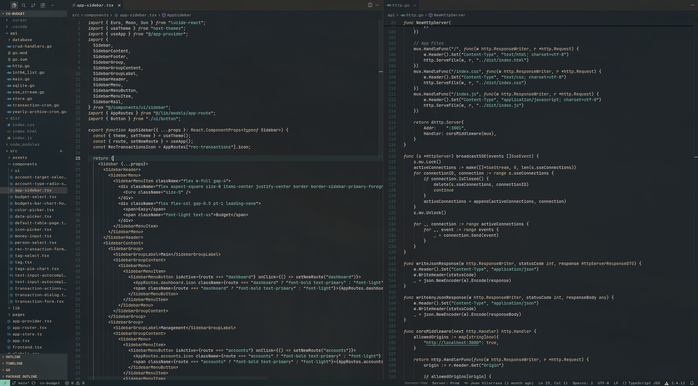
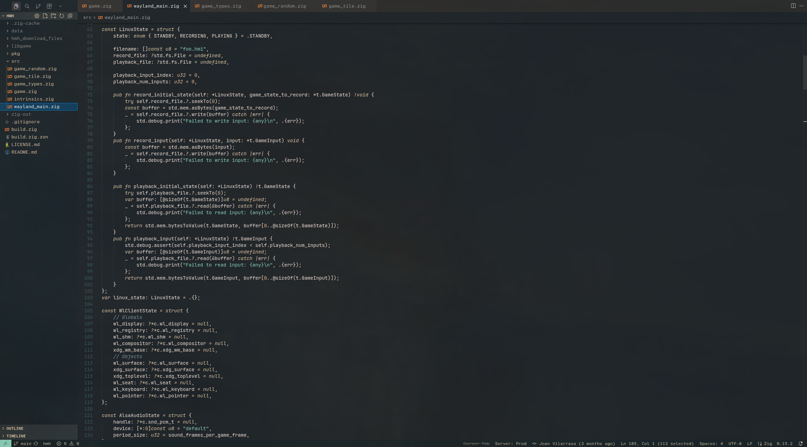

# silent-bonsai

## Screenshots

Silent Bonsai is a minimalistic, low contrast VS Code color theme inspired by dark greens and light sand tones. It is designed to be easy on the eyes, providing a calm and subtle environment for long periods of coding. This theme emphasizes clarity with gentle contrasts, making it suitable for both day and night use.

## Features

- Soothing dark greens for the editor background
- Soft sand colors for foreground and highlights
- Carefully chosen accent colors for diagnostics and brackets
- Minimal distractions with a clean, modern palette

## Installation

1. Open the Extensions view (`Ctrl+Shift+X` or `Cmd+Shift+X`).
2. Search for **silent-bonsai**.
3. Click **Install**.
4. Open the Command Palette (`Ctrl+Shift+P` or `Cmd+Shift+P`), select **Color Theme**, and choose "Silent Bonsai".
